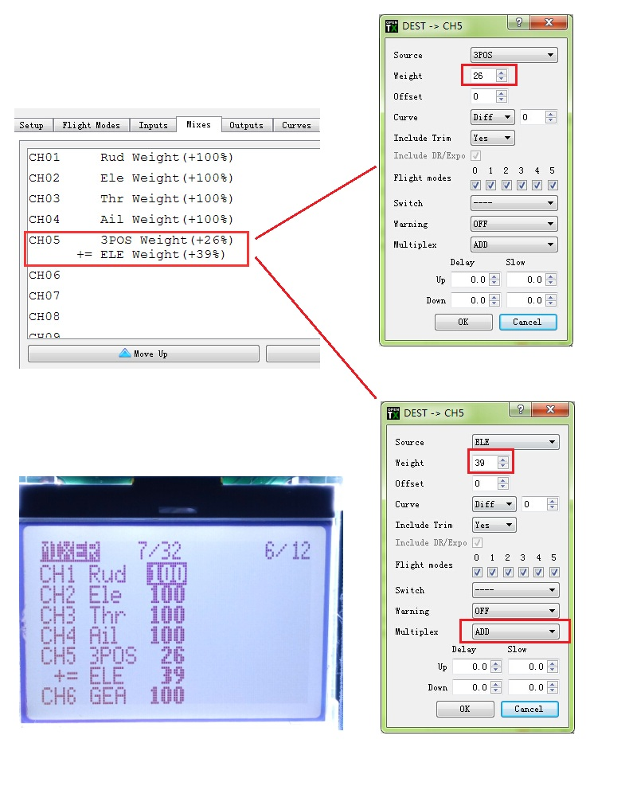
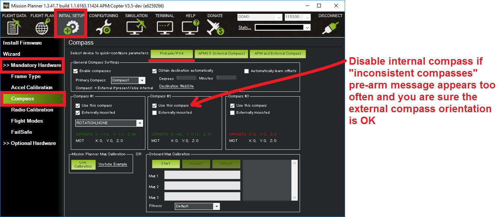
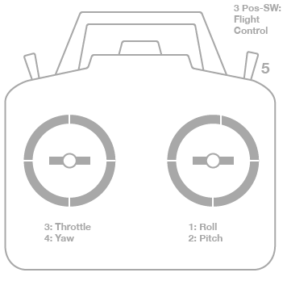
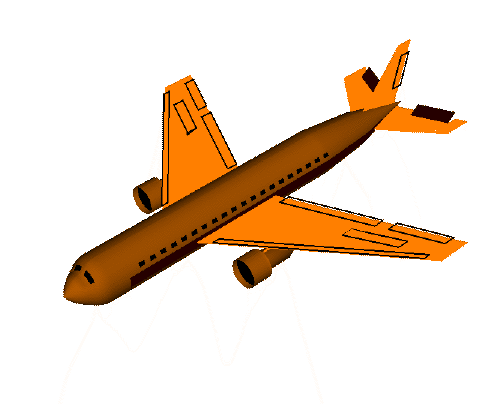
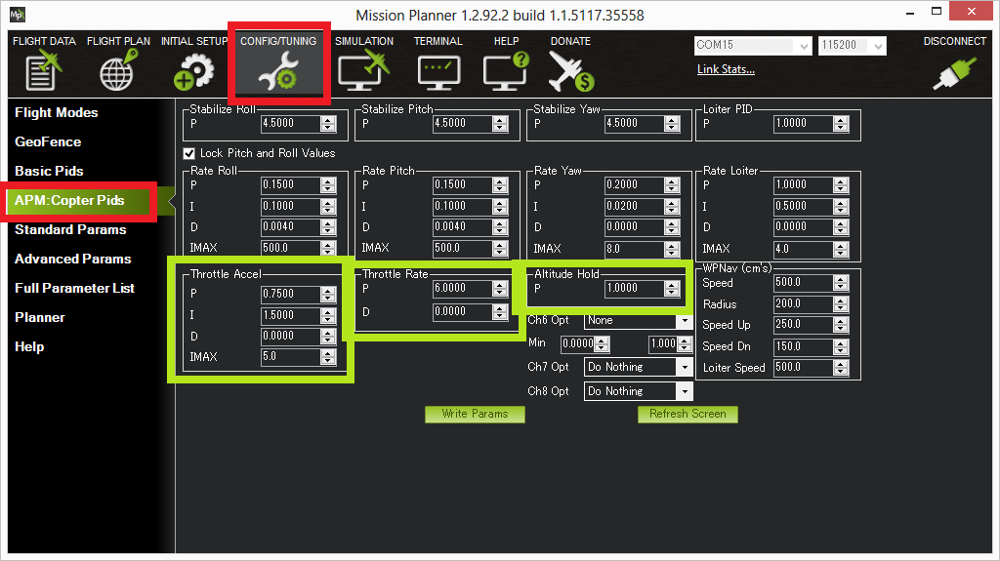

[TOC]

# ULRS遥控器的调整

目前使用 ulrs 的系统，频率：

1. 247:469.05
2. 249:469.35
3. 251:469.65----》中心频率
4. 253:469.95
5. 255:470.25

绑定码：7604

RSSI通道:16


## 飞行模式

```
观察上面的六个脉宽范围，取中间值后，重新映射到-100~100的区间内，得到：
-54 -39 -13 13 39 54 六个数，相邻数之间的差值是26。

混控设置如下图，注意三段开关的权重是26，两段开关的权重是39，两者直接相加。
```



遥控器模式设置：http://open-txu.org/home/special-interests/multirotor/opentx-apm-px4-pixhawk/

apm 的飞行模式解释：http://ardupilot.org/copter/docs/flight-modes.html

qgc飞行模式解释：https://docs.qgroundcontrol.com/en/SetupView/FlightModes.html

| 模式名称                      | QGC  | 中文         | 推荐模式？ | 非GPS锁定 | GPS锁定 | 描述                |
| ------------------------- | ---- | ---------- | ----- | ------ | ----- | ----------------- |
| Stabilize                 |      | 自稳         | *     | *      |       | 控制水平，不定点，不定高      |
| Alt Hold                  |      | 悬停         | *     | *      |       | 在自稳基础上增加气压定高      |
| Loiter                    |      | 定点         | *     |        | *     | 在定高基础上增加GPS定点     |
| RTL (Return-to-Launch)    |      | 返航         | *     |        | *     | 上升到安全高度，然后降落到起航点。 |
| Auto                      |      | 自动         | *     |        | *     | 根据预先设定的途经点进行自主飞行。 |
| Acro                      |      | 特技         |       | *      |       |                   |
| AutoTune                  |      | 自动调参       |       |        |       |                   |
| Brake                     |      |            |       |        |       |                   |
| Circle                    |      | 绕圈         |       |        | *     |                   |
| Drift                     |      | 漂移         |       |        | *     |                   |
| Guided (and Guided_NoGPS) |      | 指点模式       |       |        | *     |                   |
| Land                      |      | 降落         |       | *      |       |                   |
| PosHold                   |      | 混合模式（定点模式） |       |        | *     | 定高、定点，但是移动更直接。    |
| Sport                     |      | 运动模式       |       | *      |       |                   |
| Throw                     |      | 手抛模式       |       |        | *     |                   |
| Follow Me                 |      | 跟随模式       |       |        | *     |                   |
| Simple and Super Simple   |      | 简单和超简单模式   |       |        |       | 可以和大多模式组合。        |
| Avoid_ADSB                |      | 知道附近的飞机    |       |        |       | ！！！不是飞行模式         |

# 设置

## 罗盘设置：



注意：如果内部罗盘受到电磁干扰，请使用GPS的外置罗盘。

## 遥控设置：



1. Channel 1: Roll，左右翻滚
2. Channel 2: Pitch，俯仰
3. Channel 3: Throttle，油门
4. Channel 4: Yaw，左右旋转，方向
5. Channel 5: Flight modes
6. Channel 6: (Optional) Inflight tuning or camera mount (mapped to transmitter tuning knob)


【^roll】

【^pitch】

【^yaw】

在Mission Planner 中的遥控器设置：


```
注意！Pitch的移动方向应该与遥控器的相反，如果不对，请设置遥控器的Pitch反向。
```

<->-Ail, Thr, Ele, Rud<->

Rud,Ele,Thr,Ail

## 罗盘方向


顺时针方向转动的角度，我的是135°

## 重力加速传感器校准（Accelerometer）


## 电调校准

不同的电调，请参考相应的说明书。

```
注意！电调校准的时候，不接桨，不接USB
```

http://ardupilot.org/copter/docs/esc-calibration.html

1. 开遥控，把油门推到最大。
2. 飞控通电，红、绿、黄灯循环，表示已经准备好下一次的电调校准。
3. 油门保持最大，断开飞控电池，并重新连接电池。
4. Pixhawk，按安全开关，飞控红灯常量。
5. 飞控目前处于电调校准。
6. 。。。。按照电调进行校准
7. 油门在中位，断开电源。

## 遥控器的其他通道

http://ardupilot.org/copter/docs/channel-7-and-8-options.html

## 电量传感器的调整

http://ardupilot.org/copter/docs/current-limiting-and-voltage-scaling.html

## 安全设置

安全设置包括失控保护，电池保护，地理围栏等等

# 参数调整

## 自动调参

http://ardupilot.org/copter/docs/autotune.html

1. 拆掉云台等容易晃动的设备
2. [AUTOTUNE_AXES](http://ardupilot.org/copter/docs/parameters.html#autotune-axes) 设置需要调整的参数：roll，pitch，yaw
3. 设置调参的精度： [AUTOTUNE_AGGR](http://ardupilot.org/copter/docs/parameters.html#autotune-aggr)  (0.1=agressive, 0.075=medium, 0.050=weak)
4. 如果是13寸桨以上的大飞机，设置 Rate Roll 和 Rate Pitch 的过滤器为10Hz。 (in Copter-3.3 these are RATE_RLL_FILT_HZ and RATE_PIT_FILT_HZ, in Copter-3.4 they are ATC_RAT_RLL_FILT, ATC_RAT_PIT_FILT)
5. 最好打开： [battery voltage scaling of PID gains](http://ardupilot.org/copter/docs/current-limiting-and-voltage-scaling.html#current-limiting-and-voltage-scaling) 。
6. 无风，开阔地；
7. 使用 AltHold 模式飞行，并飞行到一个适当的高度，例如5米；
8. 打开自动调参；
9. 如果飞机飞远了，可以用遥控器拉回；
10. 任何情况下，可以终止自动调参；
11. 调参完成后，飞机将返回到以前的参数；
12. 关闭调参开关，并再次打开调参开关，飞机将以新的参数进行飞行；
13. 关闭调参开关，飞机将以旧的参数进行飞行；
14. 如果满意，打开调参开关，降落并加锁；如果不满意，关闭调参开关，降落并加锁；

If you find after performing an AutoTune that the vehicle feels overly twitchy when flying Stabilize, AltHold or PosHold (but ok in more autonomous modes like Loiter, RTL, Auto) try reducing the RC_FEEL parameter to 0.25. This smooths out the pilot’s input. Alternatively try reducing the [AUTOTUNE_AGGR](http://ardupilot.org/copter/docs/parameters.html#autotune-aggr) parameter (it should always be in the range 0.05 to 0.10) and try again.

If the vehicle feels sloppy after the AutoTune, try increasing the [AUTOTUNE_AGGR](http://ardupilot.org/copter/docs/parameters.html#autotune-aggr) parameter as high as 0.10 and attempt the autotune again.

## 定高调整



Altitude Hold P：控制实际高度与期望高度的差率。较高的值会让飞机更积极的保持高度。太高会让油门抽动。

Throttle Rate 控制定高时的油门，通常不用调整。转换爬升率到上下的加速。

The Throttle Accel PID：转换期望高度与实际高度的差值到电机输出。P、I值应该保持在1:2。这个值不能调高！如果是一个动力强劲的飞机，可能降低一点会更合适。例如P=0.5，I=1.0

# 天线

单鞭天线：Sander-style，quarter-wave whip

各种天线的制作：http://www.openuav.cn/antenna-diy/

433->164mm

http://blog.sina.com.cn/s/blog_13cb4041b0102wtps.html

http://www.openuav.cn/antenna-diy/

http://www.itluxembourg.lu/site/yagi-antennas/

## 四分之一波长计算

光速常量：C=299792458m

在导线中的速度要慢11%，按照95%取值

1/4波长=C/M/4

如果中心频率是：448.65，天线长度应该是：148.67mm

# 问题和解决

日志分析：http://ardupilot.org/copter/docs/common-diagnosing-problems-using-logs.html

震动相关的是IMU和IMU2，关心AccX, AccY and AccZ这几个参数；其中X、Y的范围在-3~+3间，Z的范围在-5~-15之间。


IMU2震动过大：

参考：http://bbs.5imx.com/forum.php?mod=viewthread&tid=1184569

将INS_USE2设为0

# 其他资源

相机固件资源 http://metropolitanmonkey.com/firmware-gitup-git1-git2/